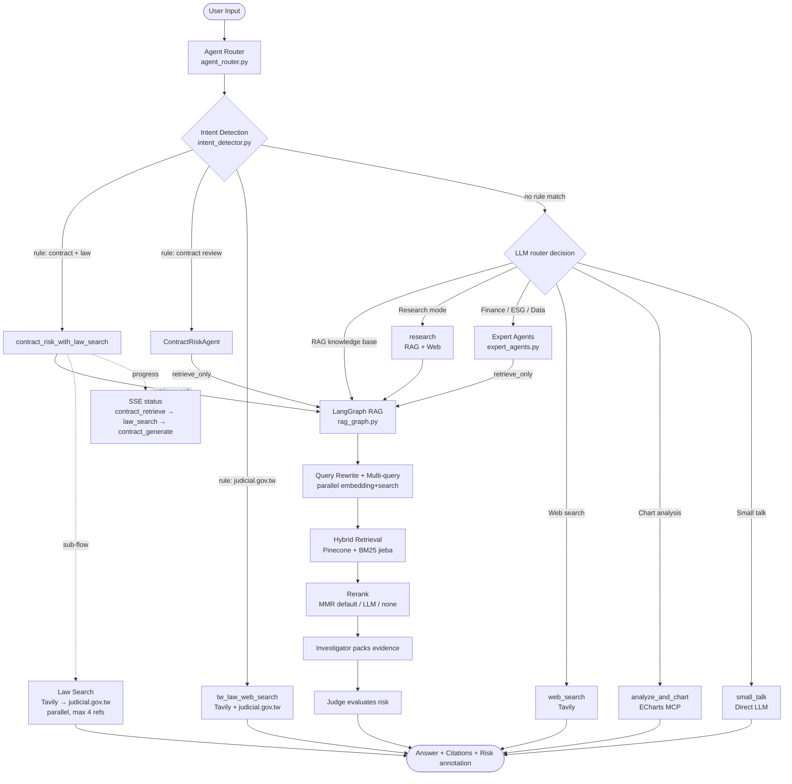
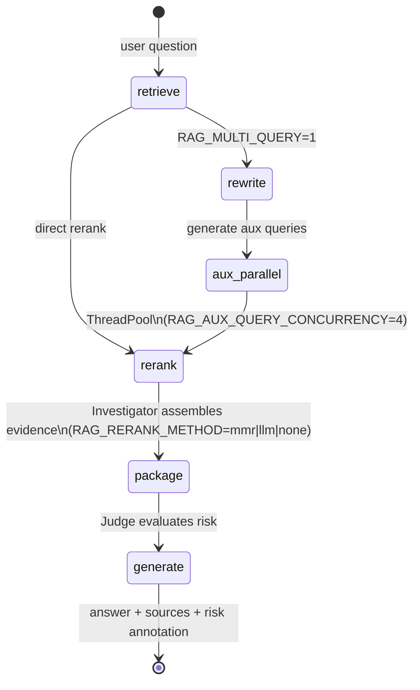
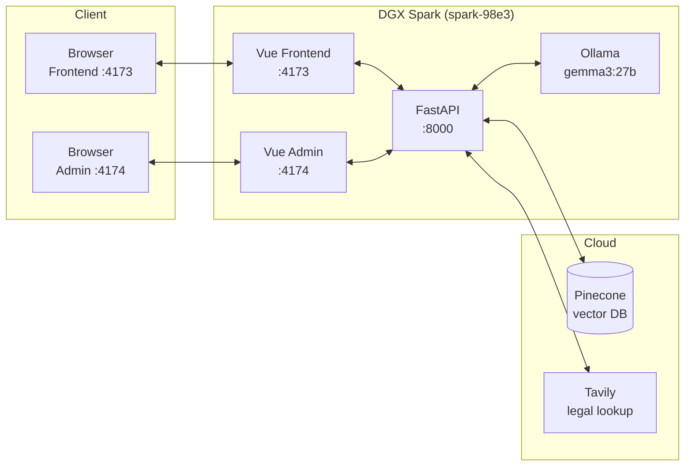
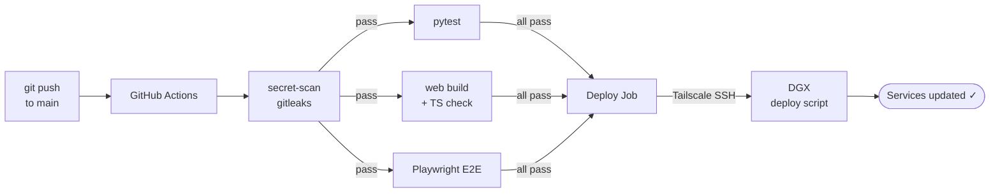

# Contract Compliance Agent

> Enterprise AI contract review: RAG + multi-expert agents + legal lookup, with Streamlit demo and FastAPI + Vue production deployment.

[](https://github.com/falltwo/Contract-compliance-agent/actions/workflows/ci.yml)
[](LICENSE)
[](https://www.python.org/downloads/)
[](https://vuejs.org/)

A contract review system built for legal, procurement, internal control, and AI product teams. It combines contract risk detection, legal reference lookup, knowledge-base Q&A, and evaluation workflows into a single entry point so teams can complete a first-pass review in minutes with traceable citations.

Traditional Chinese documentation: [README.md](README.md).

---

## Why This Project

- ⚡ Shortens first-pass review from manual clause reading to upload-and-ask or one-click review.
- ⚖️ Goes beyond summarisation — combines risk analysis with legal reference lookup to surface high-risk clauses faster.
- 🔎 Grounds every answer in retrieved chunks, supports citations, strict mode, and reduces hallucination risk.
- 🧭 Provides both `Streamlit` demo and `FastAPI + Vue` production paths so teams can go from proof-of-concept to internal deployment without rewriting.
- 📊 Includes repeatable Eval datasets and batch validation, so quality is measured, not just demonstrated.

## Who It Is For

| Audience | Best Use Case |
|----------|---------------|
| Legal / compliance teams | Find high-risk clauses quickly, compare legal references, produce a first-pass review |
| Internal AI teams | Extend an existing RAG + agent architecture for more contract types and tool chains |
| PoC / competition teams | Demo a full upload → retrieve → review → validate workflow in a short time |
| Platform / IT teams | Deploy internally with `FastAPI + Vue` on DGX or other Linux infrastructure |

---

## System Architecture

### Request Flow



### LangGraph RAG State Machine



### Deployment Architecture



### CI / Auto-Deploy Pipeline



---

## Features

- 📄 Upload contracts in `.txt`, `.md`, `.pdf`, `.docx`
- 🧠 LangGraph-powered RAG with multi-turn chat and knowledge-base Q&A
- 🔀 Agent Router that selects between RAG, contract review, legal lookup, and expert flows
- ⚖️ Contract risk assessment + legal lookup with AI self-check
- 🔍 Hybrid retrieval combining Pinecone vector search with BM25
- 🧪 Built-in Eval datasets, batch execution, and regression tracking
- 🚀 Streamlit demo UI and Vue Web app (split frontend + admin)
- 🖥️ Ollama local-model support and persistent DGX deployment
- 🤖 Auto-deploy to DGX after CI passes (GitHub Actions + Tailscale)
- 🔒 Optional Bearer-token auth for admin endpoints (`ADMIN_API_TOKEN`)
- 📊 Real dependency health check on `/health` (Ollama + Pinecone)

---

## Quick Start

### Prerequisites

| Item | Notes |
|------|-------|
| Python | `3.13+` |
| `uv` | Python package and env manager |
| Pinecone | Vector index for retrieval |
| LLM Provider | Google Gemini or Ollama |
| Tavily | Optional — enables legal / web lookup |
| Node.js LTS | Required for the Vue frontend |

### 1. Create environment variables

```bash
cp .env.example .env
# edit .env and fill in the required values
```

### 2. Required and common settings

| Variable | Required | Purpose |
|----------|----------|---------|
| `PINECONE_API_KEY` | Yes | Pinecone API key |
| `PINECONE_INDEX` | Yes | Pinecone index name |
| `CHAT_PROVIDER` | Yes | `gemini` or `ollama` |
| `GOOGLE_API_KEY` | Gemini only | Cloud chat model |
| `EMBEDDING_PROVIDER` | Recommended | `gemini` or `ollama` |
| `OLLAMA_CHAT_MODEL` | Ollama only | Local chat model name |
| `OLLAMA_EMBED_MODEL` | Ollama recommended | Local embedding model name |
| `TAVILY_API_KEY` | Optional | Legal / web search |
| `ADMIN_API_TOKEN` | Optional | Protects `/api/v1/admin/*` with Bearer token |

Recommended local-model config:

```env
PINECONE_INDEX=weck06
CHAT_PROVIDER=ollama
OLLAMA_CHAT_MODEL=gemma3:27b
EMBEDDING_PROVIDER=ollama
OLLAMA_EMBED_MODEL=snowflake-arctic-embed2:568m
```

### Team shared `.env` rules

1. `PINECONE_INDEX` is fixed at `weck06` in the shared environment — do not change without approval from the ops team.
2. Personal experiments must use a local untracked `.env` only. Do not modify `.env.example`.
3. Do not commit personal or temporary index names to `main`.

### Multi-model routing (optional)

Route cheaper stages to a smaller model to reduce GPU load and latency:

```env
# Low-cost stages (routing / rewrite / rerank)
OLLAMA_ROUTER_MODEL=gemma3:4b-it-qat
OLLAMA_RAG_REWRITE_MODEL=gemma3:4b-it-qat
OLLAMA_RAG_RERANK_MODEL=gemma3:4b-it-qat

# Main answer stage
OLLAMA_RAG_GENERATE_MODEL=gemma3:27b

# Optional high-quality contract verification
OLLAMA_CONTRACT_RISK_VERIFY_MODEL=gpt-oss:120b
```

### Timeout settings

```env
OLLAMA_TIMEOUT_SEC=120
OLLAMA_ROUTER_TIMEOUT_SEC=20
OLLAMA_RAG_REWRITE_TIMEOUT_SEC=20
OLLAMA_RAG_RERANK_TIMEOUT_SEC=25
OLLAMA_RAG_GENERATE_TIMEOUT_SEC=120
```

### 3. Install dependencies

```bash
uv sync
```

### 4. Ingest sample data

```bash
uv run rag_ingest.py
```

### 5. Launch the Streamlit demo

```bash
uv run streamlit run streamlit_app.py
# http://localhost:8501
```

---

## Web Mode: FastAPI + Vue

### Backend API

```bash
uv run uvicorn backend.main:app --reload --host 127.0.0.1 --port 8000
# Docs: http://127.0.0.1:8000/docs
```

### Frontend (local dev)

```bash
cd web && npm ci && npm run dev
# Frontend: http://localhost:5173/chat
# Admin:    http://localhost:5173/admin
```

---

## Deployment

### DGX / Internal Linux

```bash
bash scripts/install_dgx_services.sh   # first install (sets up systemd units)
bash scripts/deploy_contract_agent.sh  # manual redeploy
```

| Service | Port | Purpose |
|---------|------|---------|
| `contract-agent-api` | `8000` | FastAPI backend |
| `contract-agent-web-frontend` | `4173` | User chat / upload / sources |
| `contract-agent-web-admin` | `4174` | Admin / eval dashboard |

The deploy script automatically generates `web/.env.frontend` and `web/.env.admin` using the Tailscale IP (preferred) or LAN IP, then builds and restarts services.

Each service includes zombie-process prevention:
- `ExecStartPre`: force-kills any leftover process on the port before starting
- `KillMode=control-group`: kills the entire process tree (npm → sh → node) on stop
- `TimeoutStopSec=10`: ensures processes exit within 10 s before a new instance starts

### Auto-deploy (already configured)

Push to `main` and once all four CI jobs pass, GitHub Actions connects via Tailscale SSH and runs the deploy script on DGX automatically.

Check deploy status: GitHub repo → Actions → latest run → **Deploy to DGX** job.

---

## Usage

### Contract review

```text
Please review the risk clauses in this contract
```

```text
Summarise the high-risk clauses and list the relevant legal basis
```

### Knowledge-base Q&A

```text
How long does the confidentiality obligation last in this NDA?
```

```text
List the documents currently available in the knowledge base
```

### Strict mode

Enable strict mode in the UI to restrict answers to knowledge-base content only. Recommended for compliance and audit workflows.

---

## Tech Stack

| Category | Tools |
|----------|-------|
| Languages | Python 3.13+, TypeScript |
| Backend | FastAPI, Pydantic Settings, Uvicorn |
| Frontend | Vue 3, Vite, Pinia, Vue Router |
| Demo UI | Streamlit |
| AI / RAG | LangGraph, Pinecone, BM25 (jieba), Ollama, Google Gemini |
| External tools | Tavily (law / web search), Groq, Firecrawl (optional web scraping) |
| Testing | pytest, Playwright |
| CI/CD | GitHub Actions + Tailscale SSH |

---

## API Endpoints

| Method | Path | Description |
|--------|------|-------------|
| GET | `/health` | Health check with dependency probing (Ollama + Pinecone) |
| POST | `/api/v1/chat` | Main Q&A (RAG / agent routing) |
| POST | `/api/v1/ingest/upload` | Multi-file upload and vectorisation |
| GET | `/api/v1/sources` | List ingested sources |
| GET | `/api/v1/sources/preview` | Preview source chunks |
| GET | `/api/v1/eval/runs` | Online eval records |
| GET | `/api/v1/eval/batch/{run_id}` | Batch eval detail |
| GET | `/api/v1/admin/services` | systemd service status (auth required if token set) |
| POST | `/api/v1/admin/services/restart` | Restart services (auth required if token set) |
| GET | `/api/v1/admin/ollama/models` | Ollama loaded models (auth required if token set) |

Full schema: `http://127.0.0.1:8000/docs`

### Admin token auth

If `ADMIN_API_TOKEN` is set in `.env`, all `/api/v1/admin/*` endpoints require a Bearer token:

```bash
curl -H "Authorization: Bearer <token>" http://HOST:8000/api/v1/admin/services
```

If not set, endpoints are open (backward-compatible default).

---

## Eval and Quality Validation

```bash
uv sync --extra dev
uv run pytest --tb=short -q

uv run python eval/run_eval.py
uv run python eval/run_eval.py --eval-set eval/eval_set_contract.json
uv run python eval/run_eval.py --groq
```

Eval output: `eval/runs/run_<timestamp>_metrics.json`
Tracked metrics: routing accuracy, tool success rate, latency P50/P95.

---

## Project Structure

```text
Contract-compliance-agent/
├── agent_router.py          # Intent routing core
├── rag_graph.py             # LangGraph RAG state machine
├── rag_common.py            # Pinecone, Embedding, BM25 shared logic
├── chat_service.py          # Chat entry point and Eval logging
├── expert_agents.py         # Finance, ESG, risk expert agents
├── ingest_service.py        # Document ingest and source management
├── llm_client.py            # LLM client and multi-model routing
├── streamlit_app.py         # Demo UI
│
├── backend/
│   ├── main.py              # FastAPI app entry point
│   ├── config.py            # Pydantic Settings
│   └── api/routes/          # chat / ingest / eval / admin / health
│
├── web/                     # Vue 3 frontend (split frontend + admin)
│   └── src/
│       ├── views/           # Page components
│       ├── components/      # UI components
│       └── stores/          # Pinia state
│
├── eval/                    # Eval datasets and batch runner
├── data/                    # Sample knowledge-base files
├── deploy/systemd/          # systemd service templates
├── scripts/                 # Install and deploy scripts
├── docs/                    # Operations manual and update notes
└── tests/                   # pytest test suite
```

---

## Troubleshooting

| Symptom | What to Check |
|---------|---------------|
| No retrieval results | Verify Pinecone API key and index name; confirm data was ingested |
| Model not found | Run `ollama list`; verify `GOOGLE_API_KEY` is valid |
| Response timeout | Increase `OLLAMA_*_TIMEOUT_SEC`; reduce `TOP_K` |
| Upload fails | File must be < 32 MB in `.txt` `.md` `.pdf` `.docx` format |
| CORS error | Ensure `API_CORS_ORIGINS` or `API_CORS_ORIGIN_REGEX` includes the frontend URL |
| Auto-deploy not triggered | Confirm push to `main`; all four CI jobs must pass |
| Zombie processes | Run `sudo systemctl restart contract-agent-web-frontend contract-agent-web-admin`; `ExecStartPre` clears stale ports automatically |

---

## Limits and Disclaimer

This project is a first-pass contract review assistant, not a legal advice system.

- Output does not constitute legal advice or a formal legal opinion
- AI may misclassify, omit, or miscite; results should always be reviewed by qualified legal professionals
- Legal lookup depends on external search results; final applicability must be confirmed by humans

---

## Further Reading

- [DGX Operations Manual v1.2](docs/DGX_網站使用與維運手冊_v1.2.md)
- [Update Notes 2026-04-17](docs/update-summary-2026-04-17.md): correctness, security, and zombie process fixes
- [Update Notes 2026-04-15](docs/update-summary-2026-04-15.md)
- [backend/README.md](backend/README.md): API, testing, and deployment details
- [web/README.md](web/README.md): Vue frontend development notes

---

## Contributing

Issues and pull requests are welcome, especially for:

- contract risk rules and prompt improvements
- legal lookup quality and citation improvements
- Eval dataset expansion and regression coverage
- DGX / Linux deployment and operations improvements
- Vue admin UI and user experience improvements

Before submitting:

1. Run contract checks if you changed APIs or data structures
2. Run the relevant pytest cases if you changed chat or ingest flows
3. Manually verify `/chat`, `/upload`, and `/admin` if you changed frontend behaviour
4. Update `README` or `docs/` when startup or deployment steps change

---

## License

This project is licensed under the [MIT License](LICENSE).
