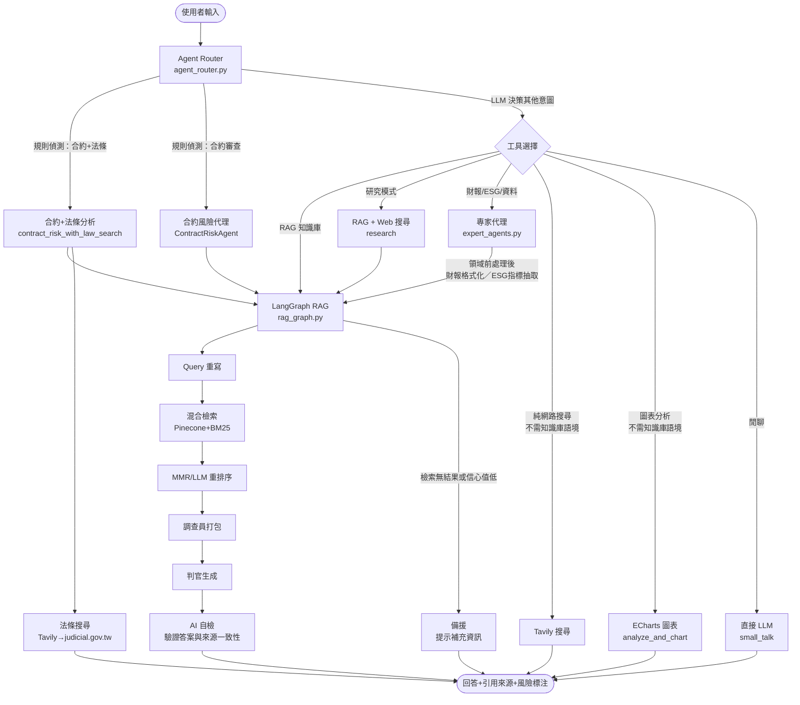
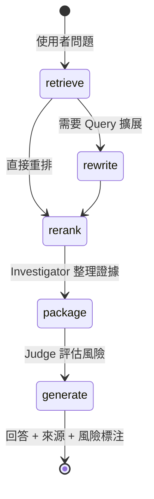
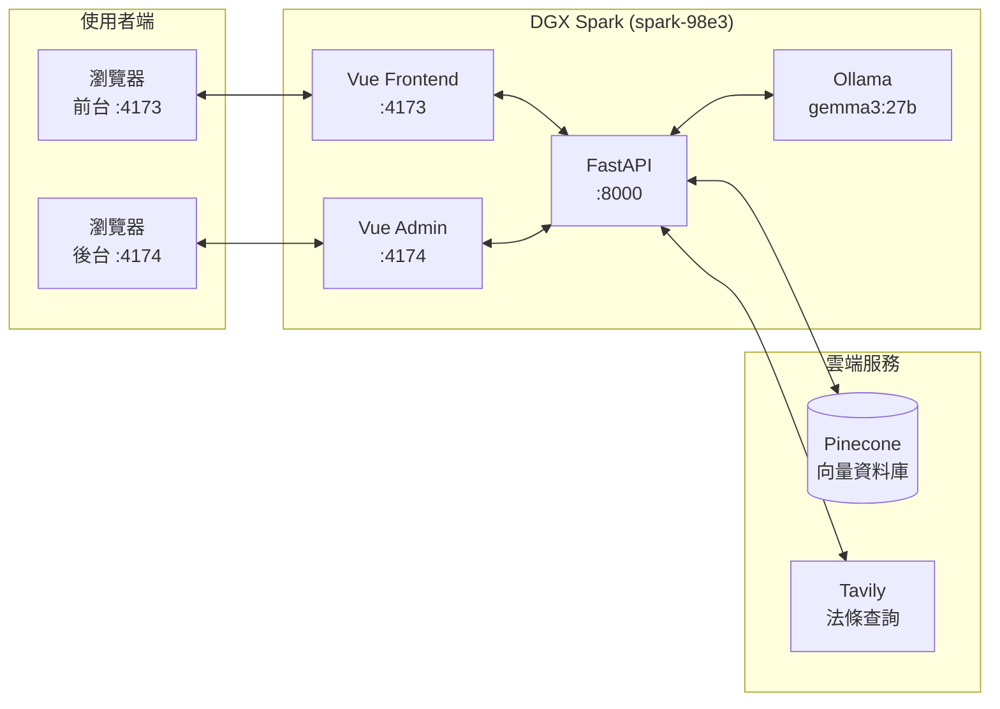
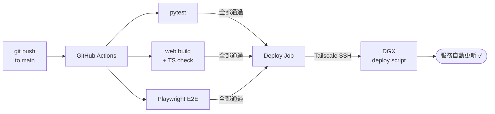

# Contract Compliance Agent

> 企業級 AI 合約審閱系統：RAG + 多專家代理 + 法條查詢，支援 Streamlit Demo 與 FastAPI + Vue 內部部署。

[](https://github.com/falltwo/Contract-compliance-agent/actions/workflows/ci.yml)
[](LICENSE)
[](https://www.python.org/downloads/)
[](https://vuejs.org/)

這是一個面向企業法務、採購、內控與內部 AI 專案團隊的合約審閱系統。它把「合約風險辨識、法條查詢、知識庫問答、評測驗證」整合成單一入口，讓使用者能在幾分鐘內完成第一輪合約審閱，並保留引用來源與可追溯性。

英文版文件請見 [README.en.md](README.en.md)。

---

## 為什麼這個專案值得看

- ⚡ 把合約初審從人工逐條閱讀，縮短成「上傳文件後直接問答或一鍵審閱」。
- ⚖️ 不只做摘要，還能結合法條查詢與風險條款說明，幫助使用者快速聚焦高風險段落。
- 🔎 回答以 RAG 檢索結果為基礎，支援引用來源、片段檢視與嚴格模式，降低幻覺風險。
- 🧭 同時提供 `Streamlit` 與 `FastAPI + Vue` 兩種介面路徑，從 Demo 到內部部署都能落地。
- 📊 內建 Eval 題集與批次驗證流程，不只生成答案，也能衡量路由準確率與工具成功率。

## 適用對象

| 對象 | 適合的使用方式 |
|------|----------------|
| 法務 / 合規團隊 | 快速找出高風險條款、比對法條、形成第一輪審閱意見 |
| 內部 AI 團隊 | 以現成 RAG + Agent 架構為基礎，擴充更多合約類型與工具鏈 |
| PoC / 競賽團隊 | 用最短時間展示「可上傳文件、可檢索、可審閱、可驗證」的完整作品 |
| 平台 / IT 團隊 | 以 `FastAPI + Vue` 方式接入內網環境，部署到 DGX 或其他 Linux 主機 |

---

## 系統架構

### 請求處理流程


```

### LangGraph RAG 狀態機



### 部署架構



### CI / 自動部署流程



---

## 功能特色

- 📄 支援合約與文件上傳，接受 `.txt`、`.md`、`.pdf`、`.docx`
- 🧠 使用 LangGraph 驅動的 RAG 流程，支援多輪對話與知識庫問答
- 🔀 透過 Agent Router 自動選擇 RAG、合約審閱、法條查詢、專家代理等工具
- ⚖️ 提供「合約風險評估 + 法條查詢」流程，整合法條搜尋與 AI 自檢
- 🔍 支援 Hybrid Retrieval，結合向量檢索與 BM25 精準匹配
- 🧪 內建 Eval 題集、批次執行與結果輸出，方便追蹤品質與回歸測試
- 🚀 提供 Streamlit Demo 介面與 Vue Web MVP，可按場景切換
- 🖥️ 支援 Ollama 本地模型與 DGX 常駐部署
- 🤖 CI 通過後自動部署到 DGX（GitHub Actions + Tailscale）

---

## 快速開始

### 先決條件

| 項目 | 說明 |
|------|------|
| Python | `3.13+` |
| `uv` | Python 套件與執行環境管理工具 |
| Pinecone | 需先建立 index，供向量檢索使用 |
| LLM Provider | 二選一：Google Gemini 或 Ollama |
| Tavily | 若要啟用法條 / 網路查詢功能則需要 |
| Node.js | 若要啟動 Vue 前端，建議使用 LTS 版本 |

### 1. 建立環境變數

```bash
cp .env.example .env
# 編輯 .env，填入必要欄位
```

### 2. 必填與常用設定

| 變數 | 是否必填 | 用途 |
|------|----------|------|
| `PINECONE_API_KEY` | 必填 | Pinecone API 金鑰 |
| `PINECONE_INDEX` | 必填 | Pinecone index 名稱 |
| `CHAT_PROVIDER` | 必填 | `gemini` 或 `ollama` |
| `GOOGLE_API_KEY` | Gemini 時必填 | 雲端聊天模型 |
| `EMBEDDING_PROVIDER` | 建議填寫 | `gemini` 或 `ollama` |
| `OLLAMA_CHAT_MODEL` | Ollama 時必填 | 本地聊天模型名稱 |
| `OLLAMA_EMBED_MODEL` | Ollama 時建議填寫 | 本地 embedding 模型名稱 |
| `TAVILY_API_KEY` | 選填 | 啟用法條 / 網路搜尋 |

推薦本地模型設定：

```env
PINECONE_INDEX=weck06
CHAT_PROVIDER=ollama
OLLAMA_CHAT_MODEL=gemma3:27b
EMBEDDING_PROVIDER=ollama
OLLAMA_EMBED_MODEL=snowflake-arctic-embed2:568m
```

### 團隊共用 `.env` 規範

1. `PINECONE_INDEX` 在共用環境固定為 `weck06`，未經維運人員同意不得修改。
2. 需要做個人實驗時，只能改自己本機未追蹤的 `.env`，不能改 `.env.example`。
3. 不得把個人 / 臨時 index 名稱提交到 `main`。

### 多模型分流（選填）

```env
# 低成本階段（路由 / rewrite / rerank）
OLLAMA_ROUTER_MODEL=gemma3:4b-it-qat
OLLAMA_RAG_REWRITE_MODEL=gemma3:4b-it-qat
OLLAMA_RAG_RERANK_MODEL=gemma3:4b-it-qat

# 主回答階段
OLLAMA_RAG_GENERATE_MODEL=gemma3:27b

# 合約高品質覆核（可選）
OLLAMA_CONTRACT_RISK_VERIFY_MODEL=gpt-oss:120b
```

### Timeout 設定

```env
OLLAMA_TIMEOUT_SEC=120
OLLAMA_ROUTER_TIMEOUT_SEC=20
OLLAMA_RAG_REWRITE_TIMEOUT_SEC=20
OLLAMA_RAG_RERANK_TIMEOUT_SEC=25
OLLAMA_RAG_GENERATE_TIMEOUT_SEC=120
```

### 3. 安裝依賴

```bash
uv sync
```

### 4. 灌入範例資料

```bash
uv run rag_ingest.py
```

### 5. 啟動 Streamlit Demo

```bash
uv run streamlit run streamlit_app.py
# http://localhost:8501
```

---

## Web 模式：FastAPI + Vue

### 後端 API

```bash
uv run uvicorn backend.main:app --reload --host 127.0.0.1 --port 8000
# API 文件：http://127.0.0.1:8000/docs
```

### 前端

```bash
cd web && npm ci && npm run dev
# 前台：http://localhost:5173/chat
# 後台：http://localhost:5173/admin
```

---

## 部署方式

### DGX / Linux 內部部署

```bash
bash scripts/install_dgx_services.sh   # 初次安裝
bash scripts/deploy_contract_agent.sh  # 手動更新
```

| 服務 | Port | 路由 |
|------|------|------|
| `contract-agent-api` | `8000` | FastAPI 後端 |
| `contract-agent-web-frontend` | `4173` | 前台（chat / upload / sources） |
| `contract-agent-web-admin` | `4174` | 後台（admin / eval） |

### 自動部署（已設定）

push 到 `main` 且 CI 全部通過後，GitHub Actions 透過 Tailscale SSH 自動執行部署腳本，組員無需手動操作 DGX。

確認部署狀態：GitHub repo → Actions → 最新 run → **Deploy to DGX** job。

詳細維運說明請參考 [`docs/DGX_網站使用與維運手冊_v1.2.md`](docs/DGX_網站使用與維運手冊_v1.2.md)。

---

## 使用說明

### 合約審閱

```text
請審閱這份合約的風險條款
```

```text
請整理高風險條款，並列出相對應的法律依據
```

### 知識庫問答

```text
這份 NDA 的保密義務持續多久？
```

```text
列出目前知識庫有哪些文件
```

### 嚴格模式

在介面中開啟嚴格模式，回答只根據知識庫內容，不混入模型推測。適用法遵或內部審核場景。

---

## 技術棧

| 類別 | 技術 |
|------|------|
| 語言 | Python 3.13+、TypeScript |
| 後端 | FastAPI、Pydantic Settings、Uvicorn |
| 前端 | Vue 3、Vite、Pinia、Vue Router |
| Demo UI | Streamlit |
| AI / RAG | LangGraph、Pinecone、BM25、Ollama、Google Gemini |
| 外部工具 | Tavily、Firecrawl、Groq |
| 測試 | pytest、Playwright |
| CI/CD | GitHub Actions + Tailscale SSH |

---

## API 端點

| 方法 | 路徑 | 說明 |
|------|------|------|
| GET | `/health` | 服務健康檢查 |
| POST | `/api/v1/chat` | 主要問答（RAG / 代理路由）|
| POST | `/api/v1/ingest/upload` | 多檔上傳與向量化 |
| GET | `/api/v1/sources` | 列出已上傳來源 |
| GET | `/api/v1/sources/preview` | 預覽來源 chunk |
| GET | `/api/v1/eval/runs` | 線上評測紀錄 |
| GET | `/api/v1/eval/batch/{run_id}` | 批次評測詳情 |
| GET | `/api/v1/admin/services` | systemd 服務狀態 |
| POST | `/api/v1/admin/services/restart` | 重啟指定服務 |
| GET | `/api/v1/admin/ollama/models` | Ollama 已載入模型 |

完整 Schema：`http://127.0.0.1:8000/docs`

---

## Eval 與品質驗證

```bash
# 執行 API 測試
uv sync --extra dev
uv run pytest tests/test_chat_api.py tests/test_ingest_api.py -v

# 執行通用評測集
uv run python eval/run_eval.py

# 執行合約評測集
uv run python eval/run_eval.py --eval-set eval/eval_set_contract.json

# 使用 Groq 加速
uv run python eval/run_eval.py --groq
```

Eval 輸出至 `eval/runs/run_<timestamp>_metrics.json`，追蹤：路由準確率、工具成功率、延遲 P50/P95。

---

## 專案結構

```text
Contract-compliance-agent/
├── agent_router.py          # 意圖路由核心
├── rag_graph.py             # LangGraph RAG 狀態機
├── rag_common.py            # Pinecone、Embedding、BM25 共用
├── chat_service.py          # 對話入口與 Eval 日誌
├── expert_agents.py         # 財務、ESG、風險專家代理
├── ingest_service.py        # 文件灌入與來源管理
├── llm_client.py            # LLM 客戶端與多模型路由
├── streamlit_app.py         # Demo UI
│
├── backend/
│   ├── main.py              # FastAPI 應用入口
│   ├── config.py            # Pydantic Settings
│   └── api/routes/          # chat / ingest / eval / admin / health
│
├── web/                     # Vue 3 前端
│   └── src/
│       ├── views/           # 頁面
│       ├── components/      # UI 元件
│       └── stores/          # Pinia 狀態
│
├── eval/                    # 評測集與批次執行器
├── data/                    # 範例知識庫文件
├── deploy/systemd/          # systemd 服務模板
├── scripts/                 # 安裝與部署腳本
├── docs/                    # 維運手冊與更新紀錄
└── tests/                   # pytest 測試
```

---

## 常見問題

| 問題 | 排查方向 |
|------|---------|
| 無檢索結果 | 確認 Pinecone API Key、Index 名稱正確，且資料已灌入 |
| 模型找不到 | 確認 `ollama list` 有對應模型，或 `GOOGLE_API_KEY` 有效 |
| 回應 Timeout | 調高 `OLLAMA_*_TIMEOUT_SEC`，或降低 `TOP_K` |
| 檔案上傳失敗 | 確認檔案 < 32MB，格式為 `.txt` `.md` `.pdf` `.docx` |
| CORS 錯誤 | 確認 `API_CORS_ORIGINS` 或 `API_CORS_ORIGIN_REGEX` 包含前端 URL |
| 自動部署未觸發 | 確認 push 到 `main`，且 CI 三個 job 全部通過 |

---

## 限制與免責聲明

本專案是「合約第一輪審閱輔助工具」，不是法律意見系統。

- 本系統輸出內容不構成法律意見或正式法律建議
- AI 可能誤判、漏判或誤引，所有結果應由合格法律專業人士複核
- 法條查詢依賴外部搜尋結果，仍需人工確認最新版本與適用性

---

## 延伸閱讀

- [DGX 使用與維運手冊 v1.2](docs/DGX_網站使用與維運手冊_v1.2.md)
- [更新紀錄 2026-04-15](docs/update-summary-2026-04-15.md)
- [backend/README.md](backend/README.md)：API、測試與部署補充
- [web/README.md](web/README.md)：Vue 前端開發說明

---

## 貢獻指南

歡迎 issue 與 pull request，特別是以下方向：

- 合約風險規則與提示詞優化
- 法條查詢流程與引用品質改善
- Eval 題集擴充與回歸測試補強
- DGX / Linux 部署與維運流程改善
- Vue 管理後台與使用者體驗優化

送出變更前，建議至少完成：

1. 若修改 API 或資料結構，執行前後端契約檢查
2. 若修改 chat / ingest 流程，執行對應 pytest
3. 若修改前端互動，至少手動驗證 `/chat`、`/upload`、`/admin`
4. 若修改啟動或部署流程，請同步更新 `README` 或 `docs/`

---

## License

本專案採用 [MIT License](LICENSE)。
