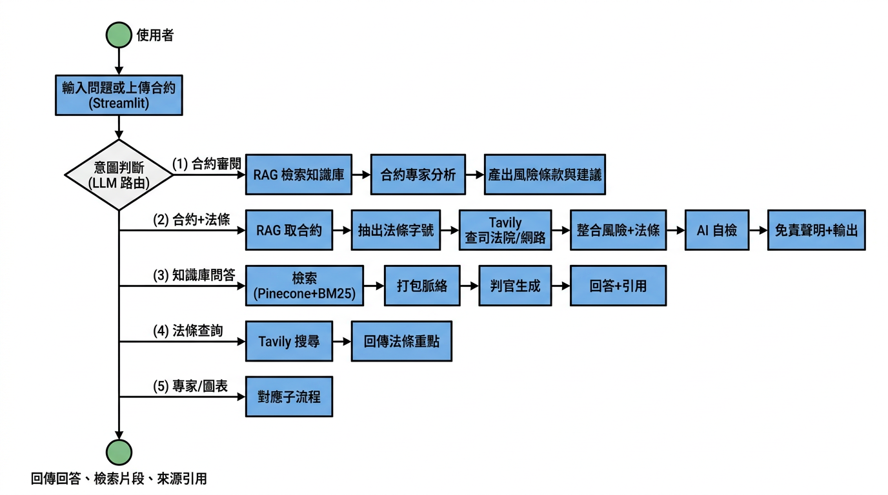
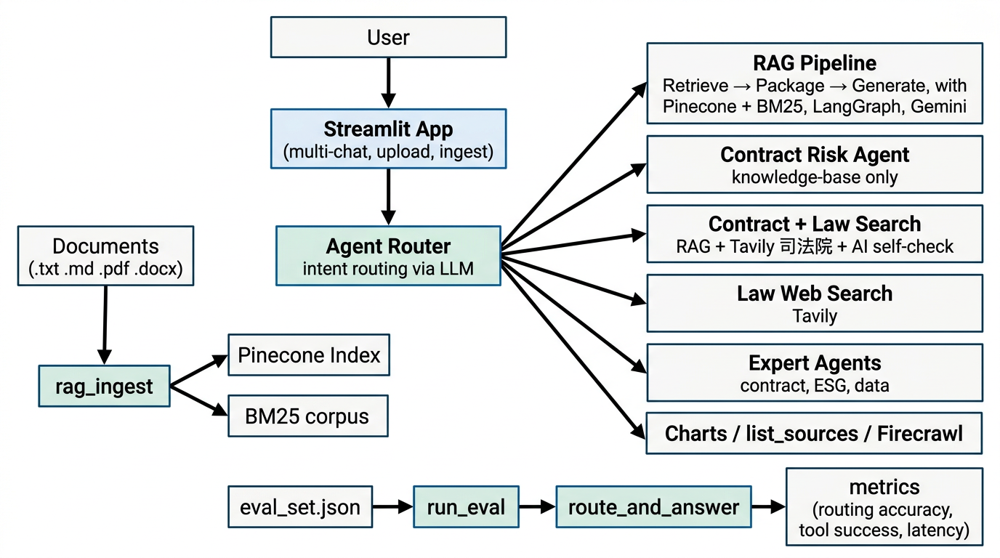

# 自主式合約風險評估代理系統

> 幫企業在**數分鐘內**完成合約第一輪審閱：自動標出風險條款、給出修改建議與法條出處，並可依對話僅檢索該次上傳檔案，兼顧效率與可追溯性。

本專案為 **2026 智慧創新大賞 AI 應用類** 參賽作品，以 **RAG + 多工具 Agent** 為核心，結合合約風險分析、司法院法條查詢、知識庫問答與 Eval 驗證；前端為 Streamlit 多對話介面，支援上傳合約（.txt / .md / .pdf / .docx）後一鍵審閱或自然語言提問。

[](https://www.python.org/downloads/)
[](https://streamlit.io)
[](LICENSE)

### 系統流程

從使用者輸入到輸出的請求流程（意圖路由 → 各工具／專家 → 回答與引用）：



---

## 快速開始

**1. 環境**

- 複製 `.env.example` 為 `.env`。
- 必填：**PINECONE_API_KEY**、**PINECONE_INDEX**。
- 使用雲端 Gemini：填入 **GOOGLE_API_KEY**（`CHAT_PROVIDER=gemini`）。
- 使用本地 Ollama（DGX 建議）：設 `CHAT_PROVIDER=ollama`、`OLLAMA_CHAT_MODEL=gemma3:27b`、`EMBEDDING_PROVIDER=ollama`、`OLLAMA_EMBED_MODEL=snowflake-arctic-embed2:568m`。
- 合約＋法條查詢需 **TAVILY_API_KEY**；其餘見 `.env.example`。

**2. 依賴與灌入**

```bash
# 安裝依賴（需 uv：https://docs.astral.sh/uv/）
uv sync

# 將合約或文件放入 data/，建立好 Pinecone index 後執行灌入
uv run rag_ingest.py
```

**3. 啟動**

```bash
uv run streamlit run streamlit_app.py
```

瀏覽器開啟後可：展開「為此對話上傳並灌入文件」上傳合約並灌入，或直接對已灌入內容提問。**側欄「合約審閱提示」** 內有「一鍵審閱（僅知識庫）」與「一鍵審閱（含法條查詢）」按鈕；或輸入：「請審閱這份合約的風險條款」「合約風險評估並查相關法條」。

---

## DGX 內部部署

若要將服務常駐在 DGX，建議改用 `FastAPI + Vue`：

```bash
bash scripts/install_dgx_services.sh
bash scripts/deploy_contract_agent.sh
```

- 後端 service：`contract-agent-api.service`（預設 `:8000`）
- 前端 service：`contract-agent-web.service`（預設 `:4173`）
- Vue production 會優先讀 `VITE_API_BASE_URL`，未設定時自動使用「目前瀏覽器主機 + `:8000`」
- 若要讓區網與 Tailscale IP 都可跨埠存取，請在 `.env` 設定 `API_CORS_ORIGIN_REGEX`

---

## 近期更新（2026-04-15）

- `main` 已合併 `weck06-0410` 與 `ewiwi`
- 已支援 `CHAT_PROVIDER=ollama` 與 `EMBEDDING_PROVIDER=ollama`
- 已補齊 DGX `FastAPI + Vue` 常駐部署所需的 `systemd` 模板、安裝腳本與部署腳本
- 前端 production 已支援 runtime API host 推導，後端也補上 `API_CORS_ORIGIN_REGEX`
- 完整更新總結見 [docs/update-summary-2026-04-15.md](docs/update-summary-2026-04-15.md)
- 文件索引見 [docs/README.md](docs/README.md)

---

## 技術亮點

| 面向 | 說明 |
|------|------|
| **定位** | 單一對話入口完成：合約審閱、法條查詢、知識庫問答、圖表；依意圖自動路由至對應工具或專家。 |
| **RAG** | LangGraph（retrieve → generate）、雙 Prompt（調查員打包脈絡 → 判官風險判定）、可選多查詢檢索、**Hybrid（向量 + BM25）**、MMR／LLM rerank。 |
| **合約＋法條** | **contract_risk_with_law_search**：RAG 取合約 → 抽法條字號 → Tavily 查司法院／網路 → 整合風險評估與法條重點 → AI 自檢 → 免責聲明。 |
| **可觀測** | Eval 題集（`eval/eval_set.json`、`eval/eval_set_contract.json`）、`run_eval.py` 產出 routing 準確率、Tool 成功率、延遲；Streamlit 可檢視 Eval 運行記錄與批次結果。 |

**技術棧**：Ollama（本地 LLM + embedding，可選）／Google Gemini（雲端）、Pinecone、LangGraph、Streamlit；可選 Tavily、Firecrawl、ECharts、Groq（Eval）。

### 系統架構

模組與資料流（前端、Agent Router、RAG／合約／法條／專家、灌入與 Eval）：



---

## 常見問題

| 項目 | 說明 |
|------|------|
| **1️⃣ AI 準確率** | 本專案以 **Eval 題集** 驗證 **意圖路由準確率**（使用者問題 → 正確工具）與 **Tool 成功率**（無異常完成率）。執行 `uv run python eval/run_eval.py` 會產出 `routing_accuracy`、`tool_success_rate` 及延遲 P50/P95，結果寫入 `eval/runs/run_<timestamp>_metrics.json`。實際數值依題集與 API 狀態而異，可重跑 Eval 取得最新數據。 |
| **2️⃣ 如何避免幻覺（hallucination）** | **(1) RAG  grounding**：先檢索再生成，回答以檢索片段為依據。**(2) 嚴格模式**：勾選「嚴格只根據知識庫回答」時，系統僅依檢索內容與歷史回答，不臆測。**(3) 雙 Prompt**：調查員打包脈絡 → 判官依脈絡產出，並要求引用 `[編號]`、文末列出 `(source#chunk)`。**(4) 合約＋法條流程**：產出後有 **AI 自檢** 步驟，以「回答＋來源摘要」請 LLM 驗證是否與來源一致，並附免責聲明。 |
| **3️⃣ 法規怎麼更新** | **即時法條查詢**：透過 Tavily 查司法院／網路，取得當下檢索結果，無需手動更新。**知識庫內文件**（含自建法規檔、合約範本）：將新檔放入 `data/` 或於 Streamlit「為此對話上傳並灌入」後執行灌入；若需全面換新，可先於側欄點「清空資料庫」再重新灌入，或直接執行 `uv run rag_ingest.py` 覆寫/追加。 |
| **4️⃣ 有沒有 evaluation dataset** | **有**。題集位於 `eval/eval_set.json`（合約／法遵主題約 20 題）、`eval/eval_set_contract.json`（合約專用）。每題含 `question` 與 `expected_tool`，用於計算意圖路由準確率與 Tool 成功率；執行方式見下方「Eval 與技術驗證」。 |
| **5️⃣ 跟 ChatGPT 差在哪** | 本系統為 **領域代理**：綁定企業合約與自建知識庫、依意圖路由到 RAG／合約審閱／法條查詢／專家；回答可 **追溯**（檢索片段、引用、AI 自檢、免責）。ChatGPT 為通用對話，不綁定你的內部文件，無法保證僅依你的合約或法規回答，且無內建 Eval 驗證。本專案適合「第一輪合約審閱＋法條對照＋可驗證產出」的場景。 |

---

## 如何試用／Demo

1. 確認 `.env` 已填、側欄「嚴格只根據知識庫回答」**未勾選**（才能走合約工具）。
2. 若有先灌入：可問「列出目前知識庫有哪些文件」。
3. 點側欄「一鍵審閱（僅知識庫）」或輸入「請審閱這份合約的風險條款」→ 檢視風險條款與「查看檢索片段」。
4. 若有 TAVILY_API_KEY：點「一鍵審閱（含法條查詢）」或輸入「合約風險評估並查相關法條」→ 檢視風險＋法條重點＋免責聲明。

更新總結、部署背景與文件入口見 **[docs/update-summary-2026-04-15.md](docs/update-summary-2026-04-15.md)** 與 **[docs/README.md](docs/README.md)**。

---

## 專案結構與文件

| 目錄／檔案 | 說明 |
|------------|------|
| **streamlit_app.py** | Streamlit 主程式（多對話、上傳灌入、問答、Eval 檢視）。 |
| **agent_router.py** | 總管 Agent：工具路由（RAG、合約／法條、專家、圖表、網路等）。 |
| **rag_graph.py** | RAG 核心：檢索、Hybrid、雙 Prompt、generate；`retrieve_only` 供專家使用。 |
| **rag_common.py** | 共用：chunk、embed、Pinecone + provider 初始化（Gemini/Ollama）、BM25 語料與 RRF 合併。 |
| **expert_agents.py** | 專家子 Agent：合約法遵、財報、ESG、資料分析。 |
| **eval/** | 題集（eval_set.json、eval_set_contract.json）與 run_eval.py；結果寫入 eval/runs/。 |
| **data/** | 預設灌入來源（內含 sample.txt、sample_contract_NDA.txt 範例）。 |
| **docs/** | 本輪更新總結與文件索引；入口 [docs/README.md](docs/README.md)。 |

---

## Eval 與技術驗證

預設題集為**合約／法遵主題**（合約審閱、法條查詢、知識庫列舉與 RAG 問答），與作品定位一致。

```bash
# 預設：合約／法遵題集（eval_set.json）
uv run python eval/run_eval.py

# 合約專用題集（eval_set_contract.json，題數較少）
uv run python eval/run_eval.py --eval-set eval/eval_set_contract.json

# 使用 Groq（需 GROQ_API_KEY）
uv run python eval/run_eval.py --groq
```

輸出：`eval/runs/run_<timestamp>_results.jsonl`、`run_<timestamp>_metrics.json`（routing 準確率、Tool 成功率、Latency）。Streamlit 側欄「Eval 批次結果」可選 run 檢視各題與指標。

---

## 進階設定（.env）

- **合約審閱**：`RAG_USE_HISTORY_FOR_QUERY=1`、`RAG_MAX_HISTORY_TURNS=12`；可選 `RAG_MULTI_QUERY=1`、`RAG_USE_BM25=1`（Hybrid 檢索）。
- **檢索**：`RAG_INTERNAL_TOP_K`、`RAG_RERANK_TOP_N`、`RAG_MMR_LAMBDA`、`RAG_MIN_SCORE` 等見 `.env.example`。
- **Eval**：`EVAL_LOG_ENABLED=1`、`EVAL_LOG_PATH`、`EVAL_RUNS_DIR`；使用 Groq 時請以指令列 `--groq` 傳入，勿在 .env 設 `EVAL_USE_GROQ=1`（否則 Streamlit 也會改用 Groq）。

---

## 授權

本專案採用 **MIT License**，詳見 [LICENSE](LICENSE)。

---

# English

## Autonomous Contract Risk Assessment Agent System

> Complete a first-pass contract review in **minutes**: automatically flag risk clauses, suggest amendments, and cite legal provisions—with optional scope-limited search (this conversation’s uploads only) for efficiency and traceability.

This project is an entry for the **2026 Smart Innovation Awards (AI Application)**. It combines **RAG and a multi-tool agent** for contract risk analysis, judicial law lookup (e.g. Taiwan’s Judicial Yuan), knowledge-base Q&A, and Eval-based validation. The UI is a Streamlit multi-turn chat that supports uploading contracts (.txt / .md / .pdf / .docx) and one-click review or natural-language questions.

### System flow

Request flow from user input to output (intent routing → tools / experts → answer and citations):


---

## Quick Start

**1. Environment**

- Copy `.env.example` to `.env`.
- Required: **PINECONE_API_KEY** and **PINECONE_INDEX**.
- For Gemini cloud chat, set **GOOGLE_API_KEY** (`CHAT_PROVIDER=gemini`).
- For local DGX/Ollama, set `CHAT_PROVIDER=ollama`, `OLLAMA_CHAT_MODEL=gemma3:27b`, `EMBEDDING_PROVIDER=ollama`, and `OLLAMA_EMBED_MODEL=snowflake-arctic-embed2:568m`.
- For contract + law lookup, set **TAVILY_API_KEY**; see `.env.example` for the rest.

**2. Dependencies and ingest**

```bash
# Install dependencies (requires uv: https://docs.astral.sh/uv/)
uv sync

# Put contracts or documents in data/, ensure Pinecone index exists, then run ingest
uv run rag_ingest.py
```

**3. Run**

```bash
uv run streamlit run streamlit_app.py
```

In the browser you can: expand “Upload and ingest documents for this conversation” to upload and ingest, or ask questions over already-ingested content. The sidebar **“Contract review prompts”** has “One-click review (knowledge base only)” and “One-click review (with law lookup)”; or type: “請審閱這份合約的風險條款” / “合約風險評估並查相關法條”.

---

## DGX internal deployment

For a persistent DGX deployment, use `FastAPI + Vue` with `systemd`:

```bash
bash scripts/install_dgx_services.sh
bash scripts/deploy_contract_agent.sh
```

- API service: `contract-agent-api.service` (default `:8000`)
- Web service: `contract-agent-web.service` (default `:4173`)
- In production, the Vue app uses `VITE_API_BASE_URL` first; if unset, it derives the API base from the current browser host plus `:8000`
- For LAN and Tailscale cross-port access, set `API_CORS_ORIGIN_REGEX` in `.env`

---

## Recent updates (2026-04-15)

- `main` now includes the merged `weck06-0410` and `ewiwi` branches
- Added `CHAT_PROVIDER=ollama` and `EMBEDDING_PROVIDER=ollama`
- Added DGX deployment assets: `systemd` templates, service installer, and deployment script
- Added runtime API host resolution in the Vue app and `API_CORS_ORIGIN_REGEX` support in FastAPI
- Full update notes: [docs/update-summary-2026-04-15.md](docs/update-summary-2026-04-15.md)
- Docs index: [docs/README.md](docs/README.md)

---

## Technical highlights

| Area | Description |
|------|-------------|
| **Positioning** | Single conversational entry point for contract review, law lookup, knowledge-base Q&A, and charts; intent-based routing to the right tool or expert. |
| **RAG** | LangGraph (retrieve → generate), dual prompt (investigator packages context → judge assesses risk), optional multi-query retrieval, **Hybrid (vector + BM25)**, MMR / LLM rerank. |
| **Contract + law** | **contract_risk_with_law_search**: RAG fetches contract → extract law references → Tavily for Judicial Yuan / web → integrated risk assessment and law highlights → AI self-check → disclaimer. |
| **Observability** | Eval sets (`eval/eval_set.json`, `eval/eval_set_contract.json`), `run_eval.py` outputs routing accuracy, tool success rate, latency; Streamlit shows Eval run log and batch results. |

**Stack**: Ollama (local LLM + embedding, optional) / Google Gemini (cloud), Pinecone, LangGraph, Streamlit; optional Tavily, Firecrawl, ECharts, Groq (Eval).

### System architecture

Modules and data flow (frontend, Agent Router, RAG / contract / law / experts, ingest and Eval):


---

## FAQ 

| Topic | Description |
|-------|-------------|
| **1️⃣ AI accuracy** | The project uses an **Eval set** to measure **routing accuracy** (user question → correct tool) and **tool success rate** (no-exception completion). Run `uv run python eval/run_eval.py` to get `routing_accuracy`, `tool_success_rate`, and latency P50/P95 in `eval/runs/run_<timestamp>_metrics.json`. Actual numbers depend on the set and API; re-run Eval for latest results. |
| **2️⃣ Avoiding hallucination** | **(1) RAG grounding**: retrieve then generate; answers are grounded in retrieved chunks. **(2) Strict mode**: when “Strict: answer only from knowledge base” is checked, the system answers only from retrieved content and history. **(3) Dual prompt**: investigator packages context → judge answers from that context, with `[id]` citations and `(source#chunk)` at the end. **(4) Contract+law flow**: an **AI self-check** step verifies that the answer is consistent with sources and appends a disclaimer. |
| **3️⃣ Updating regulations** | **Live law lookup**: Tavily queries Judicial Yuan / web for current results; no manual update. **Knowledge-base documents** (e.g. internal regulations, contract templates): add new files under `data/` or upload and ingest in Streamlit; for a full refresh, use sidebar “清空資料庫” then re-ingest, or run `uv run rag_ingest.py` to overwrite/append. |
| **4️⃣ Evaluation dataset** | **Yes.** Eval sets: `eval/eval_set.json` (contract/compliance, ~20 items), `eval/eval_set_contract.json` (contract-only). Each item has `question` and `expected_tool` for routing and tool-success metrics; see “Eval and validation” below. |
| **5️⃣ vs. ChatGPT** | This system is a **domain agent**: tied to your contracts and knowledge base, with intent-based routing (RAG / contract review / law lookup / experts) and **traceable** answers (chunks, citations, self-check, disclaimer). ChatGPT is general-purpose and does not bind to your internal docs or guarantee answers from your data; this project targets “first-pass contract review + law alignment + verifiable output” with Eval. |

---

## How to try / Demo

1. Ensure `.env` is set and the sidebar option “Strict: answer only from knowledge base” is **unchecked** (so contract tools are used).
2. If you ingested data: ask “列出目前知識庫有哪些文件” to list sources.
3. Click sidebar “One-click review (knowledge base only)” or ask “請審閱這份合約的風險條款” → view risk clauses and “View retrieved chunks”.
4. With TAVILY_API_KEY: click “One-click review (with law lookup)” or ask “合約風險評估並查相關法條” → view risk + law highlights + disclaimer.

For the latest update notes, deployment context, and docs entry points, see **[docs/update-summary-2026-04-15.md](docs/update-summary-2026-04-15.md)** and **[docs/README.md](docs/README.md)**.

---

## Project structure and docs

| Path | Description |
|------|-------------|
| **streamlit_app.py** | Streamlit app (multi-chat, upload/ingest, Q&A, Eval view). |
| **agent_router.py** | Main agent: tool routing (RAG, contract/law, experts, charts, web). |
| **rag_graph.py** | RAG core: retrieval, Hybrid, dual prompt, generate; `retrieve_only` for experts. |
| **rag_common.py** | Shared: chunk, embed, Pinecone + provider init (Gemini/Ollama), BM25 corpus and RRF merge. |
| **expert_agents.py** | Expert agents: contract compliance, financial, ESG, data analysis. |
| **eval/** | Eval sets and run_eval.py; results under eval/runs/. |
| **data/** | Default ingest source (includes sample.txt, sample_contract_NDA.txt). |
| **docs/** | Update summary and docs index; entry [docs/README.md](docs/README.md). |

---

## Eval and validation

The default Eval set is **contract/compliance** (contract review, law lookup, list sources, RAG Q&A).

```bash
# Default: contract/compliance set (eval_set.json)
uv run python eval/run_eval.py

# Contract-only set (eval_set_contract.json)
uv run python eval/run_eval.py --eval-set eval/eval_set_contract.json

# Use Groq (requires GROQ_API_KEY)
uv run python eval/run_eval.py --groq
```

Outputs: `eval/runs/run_<timestamp>_results.jsonl`, `run_<timestamp>_metrics.json` (routing accuracy, tool success rate, latency). In Streamlit sidebar, open “Eval batch results” and pick a run to inspect.

---

## Advanced settings (.env)

- **Contract review**: `RAG_USE_HISTORY_FOR_QUERY=1`, `RAG_MAX_HISTORY_TURNS=12`; optional `RAG_MULTI_QUERY=1`, `RAG_USE_BM25=1` (Hybrid).
- **Retrieval**: `RAG_INTERNAL_TOP_K`, `RAG_RERANK_TOP_N`, `RAG_MMR_LAMBDA`, `RAG_MIN_SCORE`; see `.env.example`.
- **Eval**: `EVAL_LOG_ENABLED=1`, `EVAL_LOG_PATH`, `EVAL_RUNS_DIR`; use `--groq` on the command line for Groq, do not set `EVAL_USE_GROQ=1` in .env (or Streamlit will use Groq too).

---

## License

**MIT License**; see [LICENSE](LICENSE).
